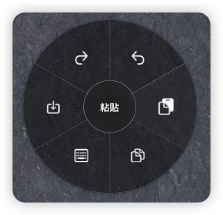

<div align="center">
  

  # MouseQuicker

  一个简洁高效的 macOS 鼠标快捷键工具，通过长按鼠标按键呼出圆形菜单，快速执行常用键盘快捷键。
</div>

## 应用展示

<div align="center">
  
  <p><em>圆形菜单界面 - 单层菜单</em></p>
</div>

## 功能特点

- **全局触发**：在任何应用中长按鼠标按键（0.1-1秒）即可呼出菜单
- **多键支持**：支持左键、中键、右键作为触发键，可在设置中切换
- **圆形菜单**：美观的饼状菜单设计，支持最多20个快捷键
- **自定义配置**：可自定义快捷键、图标、描述文字和触发按键
- **应用范围配置**：可为每个快捷键指定在哪些应用中显示和生效
- **轻量高效**：后台运行占用资源少，响应迅速

## 系统要求

- macOS 10.15 或更高版本
- 需要授予辅助功能权限

## 安装使用

### 1. 下载安装
- 从 [Releases](https://github.com/Syferie/MouseQuicker/releases) 下载最新版本
- 或者克隆源码自行编译

### 2. 权限设置
首次运行时，应用会提示需要授予辅助功能权限：

**辅助功能权限**：
- 打开 `系统偏好设置` > `安全性与隐私` > `隐私` > `辅助功能`
- 点击锁图标解锁，添加 MouseQuicker 并勾选
- 在应用设置界面可以点击"检测权限状态"来验证权限是否生效

### 3. 解决"应用已损坏"问题
如果遇到 macOS 提示应用已损坏无法打开，这是由于 Gatekeeper 安全机制导致的。请在终端中执行以下命令：

```bash
# 移除应用的隔离属性
sudo xattr -dr com.apple.quarantine /Applications/MouseQuicker.app
```

### 4. 基本操作
- **呼出菜单**：长按设置的触发键（默认为中键）0.2秒
- **选择功能**：鼠标移动到对应扇形区域，点击执行快捷键
- **取消菜单**：按 ESC 键或点击菜单外区域
- **打开设置**：点击菜单栏图标选择"设置"
- **切换触发键**：在设置界面的"应用控制"部分可选择左键、中键或右键
- **调整触发时长**：可在设置中调整长按时长（0.1-1.0秒）

## 自定义配置

在设置界面中可以：
- 添加/删除快捷键项目
- 修改快捷键组合（支持复杂组合键）
- 选择自定义图标
- 编辑描述文字
- 配置执行模式（全局执行/应用内执行）
- **配置应用范围**（所有应用/指定应用/排除应用）
- 调整触发时长
- 切换触发按键（左键/中键/右键）
- 导入/导出配置
- 调整菜单外观

## 执行模式说明

- **全局执行**：快捷键发送到系统级别，可以激活其他应用的功能（如截图、录屏等）
- **应用内执行**：快捷键发送到当前激活的应用（如复制、粘贴等）

注意：执行模式和应用范围是独立的配置，两者可以自由组合使用。

## 许可证

本项目采用CC BY-NC 4.0开源许可证，具体请查看 [LICENSE](LICENSE) 文件。

## 贡献

欢迎提交 Issue 和 Pull Request 来改进这个项目。

